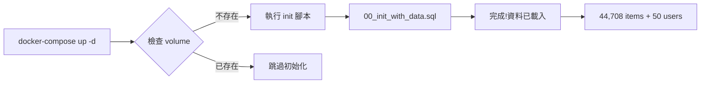

# Init 目錄使用說明

## 📂 檔案架構

### 🎯 主要檔案 (會被 Docker 自動執行)

| 檔案名稱 | 大小 | 說明 | 使用場景 |
|---------|------|------|----------|
| **00_init_with_data.sql** | 6.2MB | 完整資料庫結構 + 44,708 筆商品資料 + 50 個使用者 | 🚀 **生產環境**、正式部署、需要完整資料 |

### 📚 參考檔案 (不會被 Docker 執行)

| 檔案名稱 | 大小 | 說明 | 用途 |
|---------|------|------|------|
| **01_schema_only.sql.example** | 5.8KB | 僅資料庫結構 (不含資料) | 🧪 結構參考、手動測試用 (需改回 .sql 才能執行) |

### 📦 封存檔案 (已淘汰或備份)

| 目錄/檔案 | 說明 |
|----------|------|
| `archived/` | 舊版本、測試檔案、已淘汰的 SQL |
| `scripts/` | Python 工具腳本、資料處理程式 |
| `docs/` | 說明文件、分析報告 |

**⚠️ 重要變更 (v4.0)**:
- `01_schema_only.sql` 已重新命名為 `01_schema_only.sql.example`
- 原因: 避免與 `00.sql` 執行衝突導致資料被清空
- 如需使用: 暫時改回 `.sql` 後綴即可

---

## 🏗️ 資料庫結構說明

### 當前版本: v4.0 (2025-12-08)

#### 📊 6 個核心表格

```sql
outfit_db
├── users (使用者表) - 50 筆
│   ├── id, username, email, password_hash
│   ├── favorite_style (喜好風格)
│   └── created_at
│
├── items (商品表) - 44,708 筆 ⭐
│   ├── id, name, category, color, image_url
│   ├── sku, gender, clothing_type, length
│   ├── price DECIMAL(10,2) ✨ 已從 price_text 改為數值型別
│   ├── source (manual, uniqlo, styles_dataset, malefashion)
│   └── created_at
│
├── user_wardrobe (使用者衣櫃) - 空表
│   ├── id, user_id (FK → users.id)
│   ├── item_name, category, color, material, tags
│   └── image_url, uploaded_at
│
├── partner_products (合作商品) - 空表
│   ├── id, product_name, category, color
│   ├── price, partner_name, product_url, image_url
│   └── description, created_at
│
├── conversation_history (AI 對話記錄) - 空表
│   ├── id, user_id (FK → users.id), session_id
│   ├── message_type (user/assistant/system)
│   ├── content, metadata (JSON)
│   └── created_at
│
└── rating (商品評分) - 空表 ⭐
    ├── id, user_id (FK → users.id), item_id (FK → items.id)
    ├── rating_value (1-5 星), review_text
    ├── created_at, updated_at
    └── UNIQUE KEY (user_id, item_id) - 同一使用者對同一商品只能評分一次
```

#### 🔑 重要欄位說明

**items.price** (v4.0 更新):
- **類型**: `DECIMAL(10,2)` ✅
- **舊版**: `price_text VARCHAR(20)` (如 "NT$390")
- **新版**: `390.00` (純數值,方便計算)

**items.source** (資料來源):
- `styles_dataset`: 44,407 筆 (Kaggle 時尚資料集)
- `malefashion`: 80 筆 (男裝資料)
- `uniqlo`: 221 筆 (UNIQLO 爬蟲)
- `manual`: 手動輸入

---

## 🚀 Docker 初始化流程

### 自動執行機制



**重要規則**:
1. ✅ Docker **只在首次啟動**且 volume 不存在時執行 init 腳本
2. ✅ 只執行 `.sql` 結尾的檔案 (`.example` 不會被執行)
3. ✅ 執行順序按**檔名字母順序**: `00 → 01 → 02...`
4. ⚠️ **v4.0 更新**: 只有 `00.sql` 會被執行,`01.sql.example` 已被排除
5. ⚠️ 如果需要重新初始化,必須先刪除 volume: `docker-compose down -v`

---

## � 檔案使用指南

### 00_init_with_data.sql vs 01_schema_only.sql

| 特性 | 00_init_with_data.sql | 01_schema_only.sql |
|------|----------------------|-------------------|
| **檔案大小** | 6.2MB | 5.8KB |
| **包含資料** | ✅ 44,708 items + 50 users | ❌ 無資料 |
| **執行時間** | ~15 秒 | <1 秒 |
| **Docker 預設** | ✅ 會被執行 | ⚠️ 被跳過 (00 已建立) |
| **適用場景** | 生產、正式環境、完整測試 | 結構測試、CI/CD、快速驗證 |
| **更新策略** | 匯出完整資料 | 只需複製結構部分 |

### 🎯 使用建議

#### ✅ **方案 A: 預設使用 00.sql** (推薦)
適合:
- 🚀 正式部署
- 📊 需要完整資料測試
- 🎨 前端開發 (需要真實資料)

```bash
# 直接啟動即可 (Docker 會自動執行 00.sql)
docker-compose up -d
```

#### ✅ **方案 B: 只想要空資料庫** (測試用)
適合:
- 🧪 單元測試
- ⚡ CI/CD 快速驗證
- 🔧 結構測試

```bash
# 1. 暫時重新命名 00.sql
mv 00_init_with_data.sql 00_init_with_data.sql.bak

# 2. 重新命名 01.sql 為 00.sql (讓它優先執行)
mv 01_schema_only.sql 00_schema_only.sql

# 3. 啟動 Docker
docker-compose down -v
docker-compose up -d

# 4. 恢復檔名
mv 00_schema_only.sql 01_schema_only.sql
mv 00_init_with_data.sql.bak 00_init_with_data.sql
```

---

## 🔧 資料庫修改 SOP

### 📝 新增或修改表結構

#### **步驟 1: 同時修改兩個檔案**

⚠️ **重要**: 必須保持 `00.sql` 和 `01.sql` 完全同步!

```bash
# 1. 開啟 DBeaver 或文字編輯器
# 2. 同時編輯兩個檔案

# 範例: 新增 items.brand 欄位
# 在 00_init_with_data.sql 的 CREATE TABLE items 中加入:
ALTER TABLE items ADD COLUMN brand VARCHAR(100) DEFAULT NULL COMMENT '品牌名稱';

# 在 01_schema_only.sql 的 CREATE TABLE items 中加入相同內容
ALTER TABLE items ADD COLUMN brand VARCHAR(100) DEFAULT NULL COMMENT '品牌名稱';
```

#### **步驟 2: 驗證同步**

```bash
cd /Users/liaoyiting/Desktop/stylerec/init

# 比較 CREATE TABLE items 定義
diff <(grep -A 15 "CREATE TABLE items" 00_init_with_data.sql) \
     <(grep -A 15 "CREATE TABLE items" 01_schema_only.sql)

# 應該顯示: 無差異 (除了註解)
```

#### **步驟 3: 測試重建**

```bash
cd /Users/liaoyiting/Desktop/stylerec

# 完全重建測試
./rebuild-clean.sh

# 或手動步驟:
docker-compose down -v
docker-compose build --no-cache mysql
docker-compose up -d

# 等待初始化
sleep 15

# 驗證結構
docker exec outfit-mysql mysql -uroot -prootpassword outfit_db \
  -e "DESCRIBE items;"
```

#### **步驟 4: 提交變更**

```bash
git add init/00_init_with_data.sql init/01_schema_only.sql
git commit -m "feat: 新增 items.brand 欄位"
git push
```

---

### 🔄 更新現有資料

#### **場景 A: 新增少量資料** (< 1000 筆)

```bash
# 1. 在 00_init_with_data.sql 的 INSERT INTO items VALUES 中新增
# 2. 執行測試
./rebuild-clean.sh
```

#### **場景 B: 大量資料更新** (> 1000 筆)

```bash
# 1. 使用 DBeaver 匯出新資料
# 2. 使用 mysqldump 重新生成 00.sql

docker exec outfit-mysql mysqldump -uroot -prootpassword \
  --databases outfit_db \
  --single-transaction \
  --skip-triggers \
  --routines \
  --events \
  > init/00_init_with_data_new.sql

# 3. 替換舊檔案
mv init/00_init_with_data.sql init/archived/00_backup_$(date +%Y%m%d).sql
mv init/00_init_with_data_new.sql init/00_init_with_data.sql

# 4. 同步更新 01.sql 的結構部分
```

---

### ❌ 常見錯誤與修正

#### **錯誤 1: 兩個檔案不同步**

**症狀**: Docker 啟動後資料表結構與預期不符

**原因**: 只修改了 00.sql 或 01.sql 其中一個

**修正**:
```bash
# 檢查差異
diff init/00_init_with_data.sql init/01_schema_only.sql

# 手動同步 CREATE TABLE 部分
```

#### **錯誤 2: price 欄位類型錯誤**

**症狀**: INSERT 語句報錯 "Incorrect decimal value"

**原因**: price 欄位類型不一致 (VARCHAR vs DECIMAL)

**修正**:
```sql
-- 確保兩個檔案都使用:
price DECIMAL(10,2) DEFAULT NULL COMMENT '價格 (台幣)'

-- 而不是:
price_text VARCHAR(20) DEFAULT NULL
```

#### **錯誤 3: Docker 讀到舊資料**

**症狀**: 修改 SQL 後重啟 Docker,資料沒變

**原因**: Docker volume 持久化了舊資料

**修正**:
```bash
docker-compose down -v  # -v 刪除 volume
docker-compose up -d
```

#### **錯誤 4: 資料沒有載入 (COUNT 顯示 0)** ⚠️ **重要!**

**症狀**: 
- Docker 啟動成功
- 表格結構正確
- 但 `SELECT COUNT(*) FROM items` 顯示 0

**原因**: 
多個 SQL 檔案執行順序衝突,導致資料被覆蓋:
1. `00_init_with_data.sql` 建立表格並插入資料
2. `01_schema_only.sql` 也執行了,使用 `DROP TABLE IF EXISTS` 刪除表格
3. 重新建立空表,之前插入的資料被清空

**修正方案 A: 重新命名 01.sql** (✅ 推薦)
```bash
# 將 01.sql 改為 .example 後綴,避免被 Docker 自動執行
cd /Users/liaoyiting/Desktop/stylerec/init
mv 01_schema_only.sql 01_schema_only.sql.example

# 重建測試
docker-compose down -v
docker-compose up -d
```

**修正方案 B: 移除 01.sql 的 DROP 語句** (不推薦)
```sql
-- 在 01_schema_only.sql 中註解掉所有 DROP TABLE
-- DROP TABLE IF EXISTS rating;
-- DROP TABLE IF EXISTS items;
-- ...
```

**為什麼選方案 A?**
- ✅ 保持 01.sql 完整性 (未來可能需要)
- ✅ 不會被 Docker 自動執行
- ✅ 學員可以手動使用 (重新命名回 .sql)
- ✅ 避免檔案執行順序混亂

**驗證修正**:
```bash
# 檢查資料量
docker exec outfit-mysql mysql -uroot -prootpassword outfit_db \
  -e "SELECT COUNT(*) FROM items; SELECT COUNT(*) FROM users;"

# 應該顯示:
# items: 44708
# users: 50
```

#### **錯誤 5: users 表欄位順序不匹配**

**症狀**: INSERT INTO users 執行失敗或資料錯亂

**原因**: CREATE TABLE 的欄位順序與 INSERT VALUES 的順序不一致

**錯誤範例**:
```sql
-- CREATE TABLE 順序:
-- id, username, email, password_hash, favorite_style, created_at

-- INSERT 順序:
-- id, username, email, favorite_style, password_hash, created_at
-- ❌ password_hash 和 favorite_style 順序對調了!
```

**修正**:
```sql
-- 確保 CREATE TABLE 與 INSERT 順序一致:
CREATE TABLE users (
  id INT AUTO_INCREMENT PRIMARY KEY,
  username VARCHAR(100) UNIQUE NOT NULL,
  email VARCHAR(255) UNIQUE DEFAULT NULL,
  favorite_style VARCHAR(50) DEFAULT NULL,        -- ✅ 先 favorite_style
  password_hash VARCHAR(255) DEFAULT NULL,        -- ✅ 後 password_hash
  created_at TIMESTAMP DEFAULT CURRENT_TIMESTAMP
);

-- INSERT 也要對應:
INSERT INTO users VALUES 
(4, 'admin', 'admin@example.com', '文青', '$2b$12$...', '2025-08-04 13:19:13');
--                                  ^^^^   ^^^^^^^^^^
--                            favorite_style  password_hash
```

#### **錯誤 6: Docker 容器內檔案與本地不同步**

**症狀**: 
- 修改了本地 SQL 檔案
- 重啟 Docker 後沒有生效
- 容器內的檔案還是舊版本

**原因**: Docker 使用了 image 層快取

**修正**:
```bash
# 方法 1: 強制重建 (推薦)
docker-compose down -v
docker rmi stylerec-mysql           # 刪除舊 image
docker-compose build --no-cache mysql  # 無快取重建
docker-compose up -d

# 方法 2: 使用自動化腳本
./rebuild-clean.sh

# 驗證容器內檔案
docker exec outfit-mysql head -30 /docker-entrypoint-initdb.d/00_init_with_data.sql
```

---

## � 除錯歷程與解決方案 (v4.0)

> **學習重點**: 本節記錄了 2025-12-08 的完整除錯過程,幫助學員理解資料庫初始化的常見陷阱

### 📋 問題發現

**初始狀態**:
- ✅ Docker 容器啟動成功
- ✅ 所有 6 個表格都存在
- ❌ `SELECT COUNT(*) FROM items` 顯示 **0** (應該是 44,708)
- ❌ `SELECT COUNT(*) FROM users` 顯示 **0** (應該是 50)

### 🔍 除錯步驟

#### **第 1 步: 檢查 SQL 檔案結構**

發現問題:
1. ❌ `items` 表的 `price` 欄位類型不一致
   - `00.sql`: `price_text VARCHAR(20)`
   - `01.sql`: `price DECIMAL(10,2)`

2. ❌ `users` 表的欄位順序不一致
   - CREATE TABLE: `email, password_hash, favorite_style`
   - INSERT VALUES: `email, favorite_style, password_hash`

**修正**:
```sql
-- 統一為 DECIMAL
price DECIMAL(10,2) DEFAULT NULL

-- 統一欄位順序
CREATE TABLE users (
  id INT,
  username VARCHAR(100),
  email VARCHAR(255),
  favorite_style VARCHAR(50),    -- ✅ 調整順序
  password_hash VARCHAR(255),    -- ✅
  created_at TIMESTAMP
);
```

#### **第 2 步: 檢查 Docker 執行日誌**

```bash
docker logs outfit-mysql 2>&1 | grep -E "running|ERROR"
```

發現:
- ✅ `00_init_with_data.sql` 被執行
- ✅ `01_schema_only.sql` **也被執行** ⚠️
- ❌ 沒有錯誤訊息,但資料量為 0

**分析**: 兩個檔案都被執行了!

#### **第 3 步: 理解執行順序**

Docker entrypoint 的執行邏輯:

```
1. 啟動 MySQL
2. 檢查 /docker-entrypoint-initdb.d/ 目錄
3. 按字母順序執行所有 .sql 檔案:
   ├── 00_init_with_data.sql    ✅ 建立表 + 插入資料
   └── 01_schema_only.sql       ⚠️ DROP TABLE + 重建空表
                                ❌ 資料被清空!
```

**關鍵發現**: `01.sql` 的 `DROP TABLE IF EXISTS` 刪除了 `00.sql` 剛插入的資料!

#### **第 4 步: 驗證假設**

手動在容器內測試:

```bash
# 1. 只執行 00.sql
docker exec outfit-mysql mysql -uroot -prootpassword outfit_db \
  < /docker-entrypoint-initdb.d/00_init_with_data.sql

# 2. 檢查資料
docker exec outfit-mysql mysql -uroot -prootpassword outfit_db \
  -e "SELECT COUNT(*) FROM items;"

# 結果: 44708 ✅
```

**結論**: 單獨執行 `00.sql` 可以正常載入資料!

#### **第 5 步: 解決方案選擇**

考慮了 3 種方案:

**方案 A: 刪除 01.sql** ❌
- 缺點: 失去結構參考檔案

**方案 B: 修改 01.sql,移除 DROP 語句** ❌
- 缺點: 破壞檔案完整性,未來無法單獨使用

**方案 C: 重新命名 01.sql 為 .example** ✅
- 優點: 保留檔案,但不被 Docker 執行
- 優點: 學員仍可手動使用
- 優點: 清楚標示為「範例檔案」

#### **第 6 步: 實施解決方案**

```bash
cd /Users/liaoyiting/Desktop/stylerec/init
mv 01_schema_only.sql 01_schema_only.sql.example

# 驗證只有一個 .sql 檔案
ls -lh *.sql
# 結果: 只有 00_init_with_data.sql
```

#### **第 7 步: 完整測試**

```bash
# 完全重建
docker-compose down -v
docker rmi stylerec-mysql
docker-compose build --no-cache mysql
docker-compose up -d
sleep 25

# 驗證結果
docker exec outfit-mysql mysql -uroot -prootpassword outfit_db -e "
  SELECT COUNT(*) FROM items;   -- 44708 ✅
  SELECT COUNT(*) FROM users;   -- 50 ✅
  SHOW COLUMNS FROM items LIKE 'price';  -- DECIMAL(10,2) ✅
"
```

### ✅ 最終解決方案總結

| 問題 | 原因 | 解決方案 |
|------|------|----------|
| 資料量為 0 | 01.sql 執行順序導致資料被清空 | 重新命名為 .example |
| price 類型不一致 | 00.sql 和 01.sql 不同步 | 統一為 DECIMAL(10,2) |
| users 欄位順序錯誤 | CREATE 與 INSERT 順序不同 | 調整為一致順序 |
| Docker 快取舊檔案 | Image 層快取 | 使用 --no-cache 重建 |

### 📚 學到的教訓

1. **多個 init 檔案會依序執行** ⚠️
   - Docker 不會判斷檔案內容
   - 全部按字母順序執行
   - DROP TABLE 會影響前面的結果

2. **欄位順序很重要** ⚠️
   - CREATE TABLE 與 INSERT VALUES 必須一致
   - 使用 mysqldump 時會保持正確順序
   - 手動修改時容易出錯

3. **Docker 快取需要注意** ⚠️
   - 修改本地檔案後要用 `--no-cache` 重建
   - 檢查容器內實際檔案: `docker exec ... cat /docker-entrypoint-initdb.d/xxx.sql`

4. **測試要完整** ⚠️
   - 不只檢查表結構
   - 也要檢查資料量
   - 手動執行 SQL 可以幫助隔離問題

### 🎓 給未來維護者的建議

1. **只保留一個主要 SQL 檔案** (00.sql)
   - 簡單明瞭,避免衝突
   - 其他檔案用 .example 或 .bak 後綴

2. **修改資料庫時同步更新**
   - 00.sql (完整版)
   - 01.sql.example (結構版)
   - 確保兩者 CREATE TABLE 部分一致

3. **重建前先備份**
   ```bash
   docker exec outfit-mysql mysqldump -uroot -prootpassword outfit_db \
     > backup_$(date +%Y%m%d_%H%M%S).sql
   ```

4. **使用自動化腳本**
   ```bash
   ./rebuild-clean.sh  # 一鍵完成所有步驟
   ```

---

## �📋 日常維護檢查清單

### ✅ 每次修改資料庫後

- [ ] 同時更新 `00_init_with_data.sql` 和 `01_schema_only.sql`
- [ ] 執行 `./rebuild-clean.sh` 測試重建
- [ ] 檢查 items 表有 44,708 筆資料
- [ ] 檢查所有 6 個表格都存在
- [ ] 測試 Flask 應用連接正常
- [ ] 提交 git 變更

### ✅ 每週檢查

- [ ] 驗證 `00.sql` 和 `01.sql` 同步狀態
- [ ] 清理 `archived/` 中的舊檔案
- [ ] 檢查 Docker volume 大小
- [ ] 備份生產資料庫

---

## 🎓 給學員的提示

### 💡 理解兩個檔案的關係

**00.sql** 是 **01.sql** + **資料**:

```
00_init_with_data.sql
├── CREATE TABLE users      ← 與 01.sql 相同
├── INSERT INTO users       ← 01.sql 沒有這個
├── CREATE TABLE items      ← 與 01.sql 相同
├── INSERT INTO items       ← 01.sql 沒有這個
├── ...
```

### 💡 修改策略

1. **只改結構** → 同步修改兩個檔案的 CREATE TABLE
2. **只改資料** → 只修改 00.sql 的 INSERT INTO
3. **全部重來** → 用 mysqldump 重新生成 00.sql,手動更新 01.sql

### 💡 除錯技巧

```bash
# 快速查看表結構
docker exec outfit-mysql mysql -uroot -prootpassword outfit_db \
  -e "SHOW CREATE TABLE items\G"

# 比較本地檔案與容器內檔案
docker exec outfit-mysql cat /docker-entrypoint-initdb.d/00_init_with_data.sql \
  > /tmp/container_00.sql
diff init/00_init_with_data.sql /tmp/container_00.sql

# 查看初始化日誌
docker logs outfit-mysql 2>&1 | grep -A 10 "init"
```

---

## 📞 疑難排解

### 問題: 不確定該用哪個檔案?

**回答**:
- 🚀 正式環境 → 用 `00.sql` (預設)
- 🧪 快速測試 → 暫時改用 `01.sql`
- 📚 學習理解 → 先看 `01.sql` (結構清晰,無資料干擾)

### 問題: 如何確認兩個檔案同步?

**回答**:
```bash
cd /Users/liaoyiting/Desktop/stylerec/init

# 方法 1: 比較表數量
echo "00.sql 的表:" && grep -c "^CREATE TABLE" 00_init_with_data.sql
echo "01.sql 的表:" && grep -c "^CREATE TABLE" 01_schema_only.sql

# 方法 2: 比較表名
diff <(grep "^CREATE TABLE" 00_init_with_data.sql | awk '{print $3}' | sort) \
     <(grep "^CREATE TABLE" 01_schema_only.sql | awk '{print $3}' | sort)
```

### 問題: 可以新增 02.sql、03.sql 嗎?

**回答**: ❌ 不建議!
- 會造成執行順序混亂
- 難以維護和理解
- 應該直接修改 00.sql 和 01.sql
- 如果是 migration,請使用專業工具 (Flyway、Alembic)

---

## 📚 參考資料

### 相關文件
- `FILE_ANALYSIS_REPORT.md` - 檔案分析報告
- `DOCKER_BEST_PRACTICES.md` - Docker 最佳實踐
- `../CLEANUP_SUMMARY.md` - 資料清理歷史

### 版本歷史

#### v4.0 (2025-12-08) ⭐ 當前版本
**重大更新**: 解決資料無法載入的關鍵問題

**修正內容**:
- ✅ **修正資料載入問題**: 重新命名 `01_schema_only.sql` 為 `.example`,避免與 `00.sql` 執行衝突
- ✅ **統一 price 欄位**: 將 `price_text VARCHAR(20)` 改為 `price DECIMAL(10,2)`
- ✅ **修正 users 表欄位順序**: 確保 CREATE TABLE 與 INSERT 順序一致
- ✅ **移除冗餘檔案**: 將 `03_modify_tables.sql` 移至 archived (rating 表已整合)
- ✅ **新增完整的修改 SOP**: 包含同步檢查、測試流程、常見錯誤
- ✅ **記錄除錯歷程**: 完整的問題分析與解決方案

**檔案結構**:
```
init/
├── 00_init_with_data.sql          ✅ 唯一會被執行的檔案
├── 01_schema_only.sql.example     📚 結構參考 (不會被執行)
├── archived/                      📦 舊版本備份
│   └── 03_modify_tables_deprecated.sql
├── scripts/                       🔧 Python 工具
└── docs/                          📚 說明文件
    └── README.md (本文件)
```

**驗證結果**:
- ✅ 44,708 items 正常載入
- ✅ 50 users 正常載入
- ✅ 所有 6 個表格結構正確
- ✅ price 欄位為 DECIMAL(10,2)

#### v3.0 (2025-12-02)
- 移除所有 fashion_small 測試資料
- 優化檔名 (outfit_db_with_data.sql → 00_init_with_data.sql)

#### v2.0 (2025-12-02)
- 清理虛擬資料
- 新增 rating 表

#### v1.0 (2025-11-27)
- 初始版本

---

**📝 最後更新**: 2025-12-08  
**👥 維護者**: AI Team  
**🏷️ 當前版本**: v4.0  
**📊 資料量**: 44,708 items + 50 users
